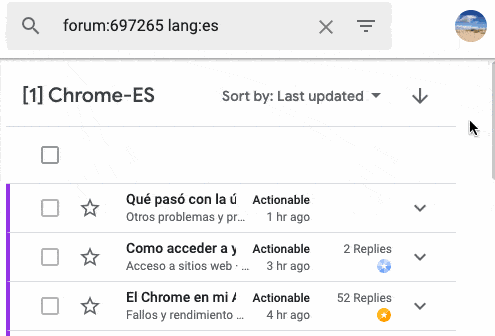

[English](features.md) • [Русский](features.ru.md)

# Funciones
La extensión Herramientas Avanzadas para TW ofrece las siguientes
funciones/opciones:

## Scroll infinito
### Listas de hilos
> **Opción:** _Activa el scroll infinito en las listas de hilos_.

Activa el scroll infinito en las listas de hilos en TW. Esta función ya se ha
añadido a la Consola de la Comunidad por parte de Google.

### Dentro de hilos
> **Opciones:** _Carga automáticamente mensajes en grupos pequeños cuando hagas
scroll por un hilo_, _Carga automáticamente todos los mensajes a la vez cuando
hagas scroll por un hilo_.

Activa el scroll infinito dentro de hilos, ambos en TW y la Consola de la
Comunidad. Ambas funciones son excluyentes, y dependiendo de cuál elijas, la
función se comportará de manera diferente:

- **Cargar mensajes en grupos pequeños**: cuando te desplaces hasta el fondo de
la página, se cargarán algunos mensajes más. Si te desplazas hasta el fondo de
nuevo, se cargarán más mensajes, etc.
- **Cargar todos los mensajes a la vez**: cuando te desplazes hasta el fondo de
la página, todos los mensajes restantes se cargarán a la vez.

## Mejoras adicionales
### Barra de herramientas de la Consola de la Comunidad
> **Opción:** _Mantén visible la barra de herramientas de la lista de hilos en
la Consola de la Comunidad_.

Fija la barra de herramientas de las listas de hilos en la Consola de la
Comunidad para que no desaparezca cuando te desplaces hacia abajo de la página.

### Redirección a la Consola de la Comunidad
> **Opción:** _Redirige todos los hilos abiertos en TW a la Consola de la
Comunidad_.

Esta función es útil si quieres que los hilos que abras desde los enlaces de los
correos de notificación se abran directamaente en la Consola de la Comunidad.

### Historial del perfil
> **Opción:** _Muestra un enlace "historial de publicaciones" en los perfiles de
usuario_.

En TW y la Consola de la Comunidad, muestra 2 enlaces en los perfiles de
usuario, que enlazan a una lista de hilos que el usuario ha creado/respodido en
el foro actual, y en todos los foros.

### Borradores de mensaje
> **Opción:** _Activa la flag enableLoadingDraftMessages de la Consola de la
Comunidad. (experimental)_.

Activa una _flag_ de la Consola de la Comunidad tal que cuando se abre el
diálogo de responder en la Consola de la Comunidad, si un borrador se había
guardado con anterioridad en los servidores de Google, se carga en el editor.

Los borradores se guardan regularmente en los servidores de Google **aunque la
_flag_ no esté activada**, así que esta _flag_ puede ayudarte a recuperar tu
trabajo si tu navegador se ha cerrado inesperadamente, por ejemplo.

### Contraste entre hilos leídos/no leídos
> **Opción:** _Incrementa el contraste entre los hilos leídos y no leídos en la
Consola de la Comunidad._

En las listas de hilos en la Consola de la Comunidad, los fondos para los hilos
leídos y no leídos son muy similares. Esta opción aumenta su contraste.

### Desplegables pegajosos en la barra lateral
> **Opción:** _Hacer que los encabezados de la barra lateral de la Consola de la
Comunidad se queden pegados arriba_

### Modo oscuro
> **Opción:** _Activa el tema oscuro en la Consola de la Comunidad_.

Esta opción te permite cargar el tema oscuro personalizado para la Consola de la
Comunidad. En la página de opciones hay un selector que te permite escoger cómo
quieres que se active el tema oscuro:

- **Botón en la Consola de la Comunidad**: un botón aparece arriba del todo de
la Consola de la Comunidad, que te permite cambiar entre el tema claro y el
oscuro.
- **Configuración del modo oscuro del SO**: cuando actives la opción del modo
oscuro en tu SO (no disponible en todos los Sistemas Operativos), el tema oscuro
se activará en la Consola de la Comunidad. Ten en cuenta que después de cambiar
la opción del SO, debes recargar la Consola de la Comunidad para cargar el tema
correspondiente.

### Esconde la barra lateral de la consola
> **Opción:** _Esconde siempre la barra lateral izquierda en la Consola de la
Comunidad._

Cuando se abra la Consola de la Comunidad, la barra lateral que muestra los
foros, filtros, etc. estará oculta/cerrada por defecto. Útil si tu pantalla es
pequeña.

### Arrastra marcadores al editor de texto (solo en Chrome)
> **Opción:** _Permite arrastrar marcadores al editor de texto de la Consola de
la Comunidad_

En Chrome, cuando se arrastran marcadores o enlaces de la Omnibox al editor de
texto enriquecido de la Consola de la Comunidad, el título del marcador/enlace
se remplaza por la URL. Esta opción lo revierte para que el texto se preserve.

### Bloquear en masa
> **Opción:** _Añade la opción para bloquear varios hilos en la lista de hilos
de la Consola de la Comunidad_.

### Sentido del orden en la Consola de la Comunidad
> **Opción:** _Activa el experimento `SMEI_SORT_DIRECTION`._

Esta opción activa un experimento disponible en la Consola de la Comunidad que
te permite ordenar las listas de hilos en sentido ascendente o descendente.

### Punto indicador
> **Opciones:** _Muestra si el autor del hilo ha participado en otros hilos_,
_Muestra el número de preguntas y respuestas escritas por el autor del hilo
durante los últimos {n} meses al lado de su nombre de usuario_.

Esta sección incluye opciones que son útiles para determinar si un usuario es
nuevo o si ha publicado en los foros antes. Se puede encontrar una descripción
completa de qué hace cada opción en
[docs/op\_indicator.es.md](op_indicator.es.md).

Estas son las posibles combinaciones de ambas opciones:

- 1a opción activada, 2a opción desactivada.

- 1a opción desactivada, 2a opción activada.

- Ambas opciones activadas.

