[English](features.md) • [Русский](features.ru.md)
• [العربية](https://docs.google.com/document/d/1QgMy4wQ0RNkreYJzaqJriXvR8xu9zI0vzoPfcDYMKU8/preview)

# Funciones
La extensión Herramientas Avanzadas para TW ofrece las siguientes
funciones/opciones:

[TOC]

## Scroll infinito
### Listas de hilos
> **Opción:** _Activa el scroll infinito en las listas de hilos_.

Activa el scroll infinito en las listas de hilos en TW. Esta función ya se ha
añadido a la Consola de la Comunidad por parte de Google.

### Dentro de hilos
> **Opciones:** _Carga automáticamente mensajes en grupos pequeños cuando hagas
scroll por un hilo_, _Carga automáticamente todos los mensajes a la vez cuando
hagas scroll por un hilo_.

Activa el scroll infinito dentro de hilos, ambos en TW y la Consola de la
Comunidad. Ambas funciones son excluyentes, y dependiendo de cuál elijas, la
función se comportará de manera diferente:

- **Cargar mensajes en grupos pequeños**: cuando te desplaces hasta el fondo de
la página, se cargarán algunos mensajes más. Si te desplazas hasta el fondo de
nuevo, se cargarán más mensajes, etc.
- **Cargar todos los mensajes a la vez**: cuando te desplazes hasta el fondo de
la página, todos los mensajes restantes se cargarán a la vez.

## Mejoras adicionales
### Barra de herramientas de la Consola de la Comunidad
> **Opción:** _Mantén visible la barra de herramientas de la lista de hilos en
la Consola de la Comunidad_.

Fija la barra de herramientas de las listas de hilos en la Consola de la
Comunidad para que no desaparezca cuando te desplaces hacia abajo de la página.

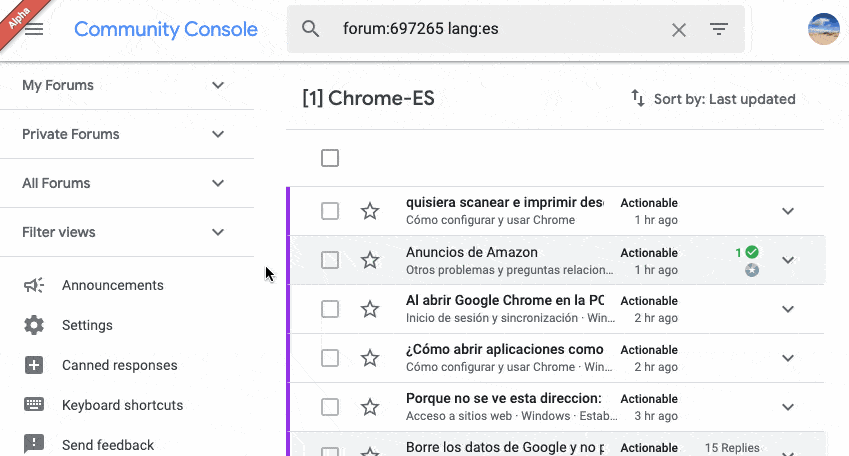

### Redirección a la Consola de la Comunidad
> **Opción:** _Redirige todos los hilos abiertos en TW a la Consola de la
Comunidad_.

Esta función es útil si quieres que los hilos que abras desde los enlaces de los
correos de notificación se abran directamaente en la Consola de la Comunidad.

### Historial del perfil
> **Opción:** _Muestra un enlace "historial de publicaciones" en los perfiles de
usuario_.

En TW y la Consola de la Comunidad, muestra 2 enlaces en los perfiles de
usuario, que enlazan a una lista de hilos que el usuario ha creado/respodido en
el foro actual, y en todos los foros.

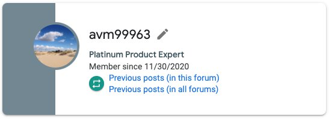

### Borradores de mensaje
> **Opción:** _Activa la flag enableLoadingDraftMessages de la Consola de la
Comunidad. (experimental)_.

Activa una _flag_ de la Consola de la Comunidad tal que cuando se abre el
diálogo de responder en la Consola de la Comunidad, si un borrador se había
guardado con anterioridad en los servidores de Google, se carga en el editor.

Los borradores se guardan regularmente en los servidores de Google **aunque la
_flag_ no esté activada**, así que esta _flag_ puede ayudarte a recuperar tu
trabajo si tu navegador se ha cerrado inesperadamente, por ejemplo.

### Contraste entre hilos leídos/no leídos
> **Opción:** _Incrementa el contraste entre los hilos leídos y no leídos en la
Consola de la Comunidad._

En las listas de hilos en la Consola de la Comunidad, los fondos para los hilos
leídos y no leídos son muy similares. Esta opción aumenta su contraste.

### Desplegables pegajosos en la barra lateral
> **Opción:** _Hacer que los encabezados de la barra lateral de la Consola de la
Comunidad se queden pegados arriba_

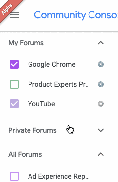

### Modo oscuro
> **Opción:** _Activa el tema oscuro en la Consola de la Comunidad_.

Esta opción te permite cargar el tema oscuro personalizado para la Consola de la
Comunidad. En la página de opciones hay un selector que te permite escoger cómo
quieres que se active el tema oscuro:

- **Botón en la Consola de la Comunidad**: un botón aparece arriba del todo de
la Consola de la Comunidad, que te permite cambiar entre el tema claro y el
oscuro.
- **Configuración del modo oscuro del SO**: cuando actives la opción del modo
oscuro en tu SO (no disponible en todos los Sistemas Operativos), el tema oscuro
se activará en la Consola de la Comunidad. Ten en cuenta que después de cambiar
la opción del SO, debes recargar la Consola de la Comunidad para cargar el tema
correspondiente.

### Esconde la barra lateral de la consola
> **Opción:** _Esconde siempre la barra lateral izquierda en la Consola de la
Comunidad._

Cuando se abra la Consola de la Comunidad, la barra lateral que muestra los
foros, filtros, etc. estará oculta/cerrada por defecto. Útil si tu pantalla es
pequeña.

### Arrastra enlaces al editor de texto (solo en Chrome)
> **Opción:** _Permite arrastrar enlaces al editor de texto de la Consola de la
Comunidad preservando su texto_.

En Chrome, cuando se arrastran marcadores o enlaces de la Omnibox al editor de
texto enriquecido de la Consola de la Comunidad, el título del marcador/enlace
se remplaza por la URL. Esta opción lo revierte para que el texto se preserve.

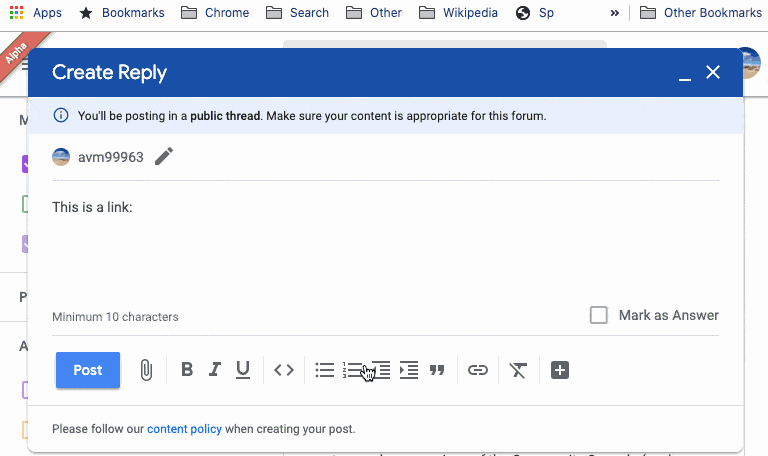

### Bloquear en masa
> **Opción:** _Añade la opción para bloquear varios hilos en la lista de hilos
de la Consola de la Comunidad_.

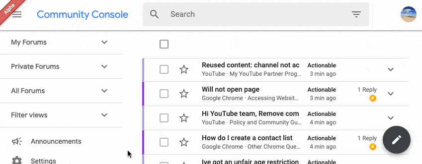

### Indicador de anuncios nuevos más prominente
> **Opción:** _Muestra el punto que notifica que hay anuncios sin leer de manera
más prominente en la Consola de la Comunidad._.

Cuando esta opción está activada, el banner "Alpha" que aparece en la esquina
superior izquierda de la Consola de la Comunidad se oculta, y el punto de
notificación que aparece en el menú de hamburguesa cuando hay un nuevo anuncio
se hace más grande y animado para que lo veas mejor.

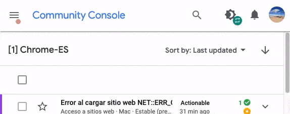

### Reposiciona el botón para expandir hilos
> **Option name:** _Pon el botón "expandir hilo" a la izquierda del todo en las
listas de hilos de la Consola de la Comunidad._.

### Avatares/fotos de perfil en las listas de hilos
> **Opción:** _Muestra fotos de perfil en las listas de hilos de la Consola de
la Comunidad_.

Cuando esta opción está activada, se mostrarán los avatares/fotos de perfil en
las listas de hilos de la Consola de la Comunidad al lado de cada hilo, para
mostrar quién ha participado en cada hilo.

La extensión obtiene el mensaje principal y las primeras 15 respuestas, y
muestra los avatares en orden (el primer avatar corresponde a la primera persona
que se ha unido al hilo). Si un usuario no ha configurado un avatar, se salta,
y solo se muestran un máximo de 3 avatares.

#### Problemas conocidos
- Los avatares no se muestran para hilos en foros privados, debido a razones
técnicas.
- Solo el mensaje principal y las primeras 15 respuestas son consideradas para
cada hilo, así que si alguien se une al hilo después de este límite, su avatar
no aparecerá.
- Cuando se vuelve de un hilo a la lista de hilos haciendo clic en el botón
"atrás", los avatares tardan unos segundos en aparecer.
- Si más de 3 personas con avatar han publicado un mensaje, la extensión no lo
indicará de ninguna manera, solo mostrará los primeros 3 avatares.
- Aunque un EP no tenga insignia en un foro, su avatar se mostrará en la lista
de hilos (esto es de hecho por diseño, no es un problema). Aun así, el avatar
no se mostrará dentro del hilo.
- Si un EP cambia su avatar, podrías continuar viendo el viejo en las listas de
hilos, debido al hecho que los avatares se guardan en una caché, y solo se
actualizan cuando se publica una nueva respuesta en el hilo.

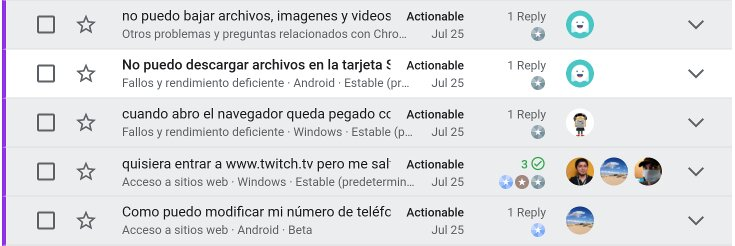

### Notificación cuando una lista de hilos recibe actualizaciones
> **Opción:** _Muestra una notificación en la Consola de la Comunidad cuando una
lista de hilos recibe actualizaciones._

Esta función comprueba si hay nuevos hilos en la lista de hilos actual cada 3
minutos, y te notifica cuando hay nuevos hilos arriba del todo de la lista. La
notificación es una "notificación suave": te notifica añadiendo algunos signos
de exclamación (`[!!!]`) al principio del nombre de la pestaña, y mostrándote un
mensaje en la página, como puedes ver en la siguiente captura de pantalla:

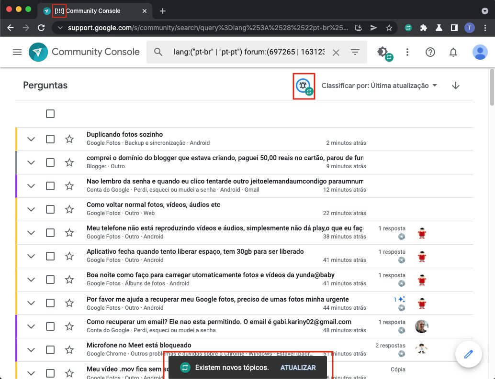

Te notifica con una notificación suave en vez de una notificación en sí porque
de esta manera puedes controlar cuándo quieres participar en los foros o no. Si
no estás prestando atención a la pestala de la Consola de la Comunidad, no te
molestará.

Esta función solo funciona en la Consola de la Comunidad, no en los foros
públicos, y solo cuando las opciones de orden están establecidas a "Ordenar por:
Última actualización" y orden descendiente. El icono de la campana que hay al
lado de las opciones de orden te indicará si las opciones del orden están
correctamente establecidas (y por tanto esta función funcionará) o no.

### Limita la altura de imágenes
> **Opción:** _Limita la altura de las imágenes insertadas en mensajes a
la altura de la ventana._

A veces los usuarios suben capturas de pantalla en alta definición de su
teléfono, lo que resulta en que en el foro se muestra una imagen muy alta. Esta
función añade un estilo personalizado que establece una altura máxima para las
imágenes dentro de mensajes del foro, para que no sean más altas que la ventana
actual.

### Bloquear que los borradores de mensaje se guarden en los servidores de Google
> **Opción:** _Bloquea el envío de tus respuestas mientras las escribes a los
servidores de Google en la Consola de la Comunidad._

La Consola de la Comunidad tiene una función que permite a los usuarios guardar
en los servidores de Google borradores regulares del mensaje que están
escribiendo en la caja de respuesta, para que puedan recuperarlo más tarde (por
ejemplo si el ordenador crashea).

En teoría, esta función está controlada por la _flag_ llamada
`enableLoadingDraftMessages`, que está desactivada por defecto. Sin embargo,
aunque la _flag_ esté desactivada, la Consola de la Comunidad continúa guardando
(y eliminando) el borrador del mensaje (véase
[este vídeo](https://drive.avm99963.com/s/AdEBZRDCye15aU3)). Por tanto, lo único
que cambia la _flag_ es si el borrador guardado se intenta recuperar o no.

Esta opción bloquea todas estas peticiones de red para guardar, eliminar y
recuperar borradores para que la función esté efectivamente desactivada.

### Actividad separada por foros en perfiles
> **Opción:** _Muestra la actividad separada por foros en los perfiles de
la Consola de la Comunidad._

Una imagen vale más que mil palabras:

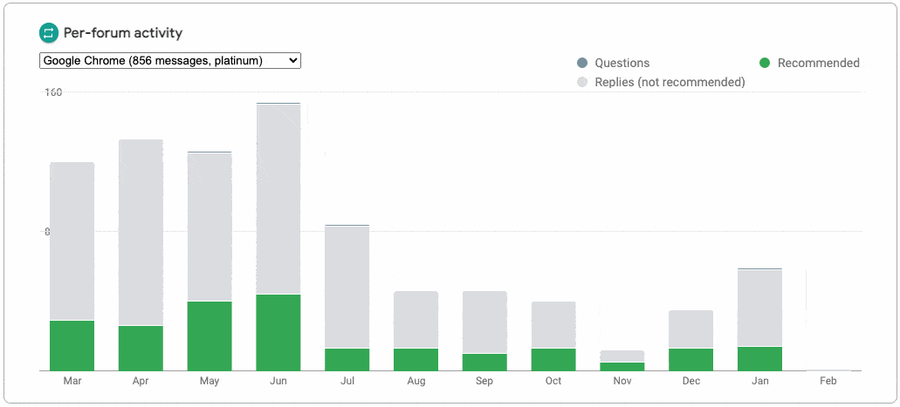

### Diseño de los hilos en la Consola de la Comnuidad
> **Opción:** _Muestra el diseño viejo/nuevo de los hilos en la Consola de
la Comunidad._

Esta opción te permite forzar el diseño viejo o nuevo de las páginas de los
hilos en la Consola de la Comunidad. El diseño viejo de estas páginas era
exclusivo a la Consola, mientras que el nuevo tiene el mismo diseño que las
páginas públicas de los hilos (en TW).

### Reduce espacio en blanco
> **Opción:** _Reduce el espacio en blanco en la Consola de la Comunidad y TW._

Esta opción reduce el espacio en blanco excesivo en la Consola de la Comunidad y
TW, como se muestra en la siguientes capturas:

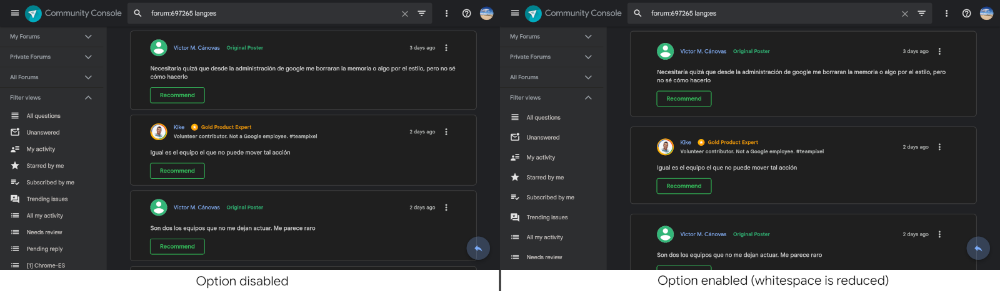

También reduce el espacio en blanco en las listas de hilos en pantallas pequeñas
para que los títulos quepan mejor y se puedan leer:

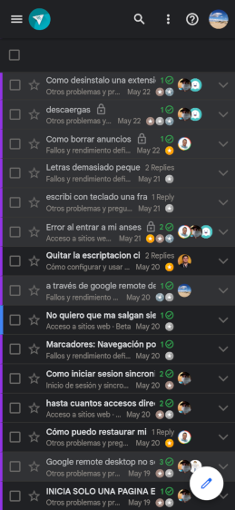

### Allana los hilos
> **Opción:** _Muestra un selector para activar/desactivar la vista anidada en
los hilos._

Esta opción añade un selector en los hilos justo debajo del post principal que
te permite cambiar entre la vista anidada que hay por defecto y una nueva vista
que muestra todas las respuestas en una vista lineal y no anidada, como
anteriormente.

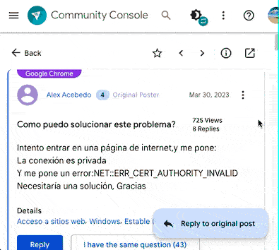

### Informa respuestas masivamente
> **Option name:** _Activa poder informar varias respuestas a la vez._

Esta opción añade un interruptor en la barra de herramientas de los hilos
(justo debajo del post principal) que, cuando se activa, hace que se muestre
una interfaz especial que te permite reportar múltiples hilos fácilmente:

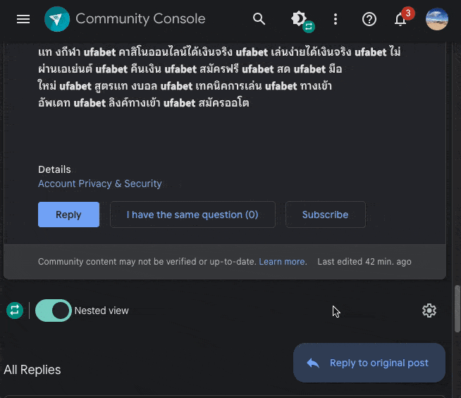

También puedes usar el atajo "Alt + R" (equivalentemente, "⌥  + R" para
usuarios de Mac) para activar/desactivar la interfaz.

## Punto indicador
> **Opciones:** _Muestra si el autor del hilo ha participado en otros hilos_,
_Muestra el número de preguntas y respuestas escritas por el autor del hilo
durante los últimos {n} meses al lado de su nombre de usuario_.

Esta sección incluye opciones que son útiles para determinar si un usuario es
nuevo o si ha publicado en los foros antes. Se puede encontrar una descripción
completa de qué hace cada opción en
[docs/op\_indicator.es.md](op_indicator.es.md).

Estas son las posibles combinaciones de ambas opciones:

- 1a opción activada, 2a opción desactivada.

- 1a opción desactivada, 2a opción activada.

- Ambas opciones activadas.

