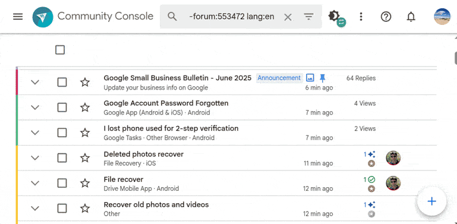

[En español](features.es.md) • [Русский](features.ru.md)
• [العربية](https://docs.google.com/document/d/1QgMy4wQ0RNkreYJzaqJriXvR8xu9zI0vzoPfcDYMKU8/preview)

# Features
The TW Power Tools extension offers the following features/options:

[TOC]

## Infinite scroll
### Thread lists
> **Option name:** _Enable infinite scrolling in thread lists_.

Enables infinite scroll in thread lists in TW. This feature has already been
added to the Community Console by Google.

### Inside threads
> **Option names:** _Automatically load batches of messages inside threads when
scrolling down_, _Automatically load all messages at once inside threads when
scrolling down_.

Enables infinite scroll inside threads, both in TW and the Community Console.
Both options are mutually exclusive, and depending on which one you choose, the
feature will behave differently:

- **Load batches of messages**: when scrolling to the bottom, some more messages
will be loaded. If you scroll to the bottom again, more messages will be loaded,
and so on.
- **Load all messages at once**: when scrolling to the bottom, all the remaining
messages will be loaded at once.

## Additional enhancements
### Community Console toolbar
> **Option name:** _Make the toolbar stick at the top of thread lists in the
Community Console_.

Fixes the toolbar of thread lists in the Community Console so it doesn't
disappear when scrolling down.

### Redirect to the Community Console
> **Option name:** _Redirect all threads opened in TW to the Community Console_.

This feature is useful if you want the threads you open from the email
notification link directly in the Community Console.

### Profile history
> **Option name:** _Show a "previous posts" link in user profiles_.

Both in TW and the Community Console, show 2 links in user profiles, which link
to the list of threads that the user has created/replied to in the current
forum, and in all the forums.

### Draft messages
> **Option name:** _Activate the `enableLoadingDraftMessages` Community Console
flag_.

Enables a Community Console flag which, when opening the reply dialog in a
thread in the Community Console, if a draft message was saved in the Google
servers, it is loaded in the editor.

Draft messages are saved regularly into Google Servers **even if the flag is not
enabled**, so this flag can help you recover your work from a crash, for
example.

### Contrast between read/unread threads
> **Option name:** _Increase contrast between read and unread threads in the
Community Console_.

In thread lists in the Community Console, the backgrounds for read and unread
threads are very similar. This option increases this contrast.

### Sticky drawer headers
> **Option name:** _Make the headers in the Community Console sidebar stick at
the top_.

### Dark mode
> **Option name:** _Enable the dark theme in the Community Console_.

This setting lets you load a custom-built dark theme for the Community Console.
In the options page there is a selector which lets you choose how the dark theme
gets enabled:

- **Switch in the Community Console**: a button appears at the top of the
Community Console, which lets you switch between the light and dark themes.
- **OS dark mode settings**: when you enable the OS wide dark mode setting (not
available in all Operating Systems), the dark theme is enabled in the Community
Console. Note that after you change the OS setting, you should reload the
Community Console in order to load the corresponding theme.

### Hide the Community Console drawer
> **Option name:** _Always hide the drawer (left column) in the Community
Console_.

When opening the Community Console, the sidebar which shows the forums, filters,
etc. will be hidden/closed by default. Useful if your screen is small.

### Drag and drop links to the text editor (Chrome-only)
> **Option name:** _Allow to drag and drop links to the Community Console text
editor while preserving the text_.

In Chrome, when drag and dropping bookmarks or Omnibox links to the Community
Console rich text editor, the bookmark/link title gets replaced by the URL.
This option reverses this so the text gets preserved.

### Batch lock
> **Option name:** _Add the option to lock multiple threads from the Community
Console thread list_.

### More prominent announcements dot
> **Option name:** _Show the announcements notification dot more prominently in
the Community Console_.

When this option is enabled, the "Alpha" banner in the upper-left corner of the
Community Console is removed, and the notification dot which appears in the
hamburger menu when there's a new announcement is enlarged and animated so you
don't miss it.

### Reposition the expand thread button
> **Option name:** _Place the "expand thread" button all the way to the left in
the Community Console thread lists_.

### Avatars in thread lists
> **Option name:** _Show avatars in thread lists in the Community Console_.

When this option is enabled, in thread lists in the Community Console avatars
will be shown next to each thread to show the avatars of the people who have
participated in the thread.

The extension retrieves the main message and the first 15 replies, and shows
the avatars in order (the first avatar corresponds to the first person who
joined the thread). If a user hasn't set an avatar, it is skipped, and only up
to 3 avatars are shown.

#### Known issues
- Avatars aren't shown for threads in private forums, due to technical reasons.
- Only the main message and the first 15 replies are considered in each thread,
so if someone joins the thread after this limit, their avatar won't appear.
- When going back from a thread to the thread list by clicking the "back"
button, avatars take some seconds to appear.
- If more than 3 people with avatar have posted a message, the extension will
not indicate this in any way, it will just show the first 3 avatars.
- Even if a PE is not badged in a forum, their avatar will be shown in the
thread list (this is actually a feature, not an issue). The avatar won't show
however inside the thread.
- If a PE changes their avatar, you might still see the old one in the thread
list, due to the fact that avatars are stored in a cache, and are only updated
when a new reply is posted in the thread.

### Notification when a thread list receives updates
> **Option name:** _Show a notification in the Community Console when a thread
list has new updates._

This feature checks whether there are new threads in the current thread list
every 3 minutes, and notifies you when there are new threads at the top of the
list. The notification is a "soft notification": it notifies you by adding some
exclamation marks (`[!!!]`) at the beginning of the tab title, and by showing a
snackbar in the page, as you can see in the following screenshot:

It notifies you with a soft notification instead of an actual notification
because this way you can control when you want to participate in the forums or
not. If you're not paying attention to the Community Console tab, you won't be
bothered.

This feature only works in the Community Console, not in the public forums, and
only when the sort settings are set to "Sort by: Last Updated" and descending
order. The bell icon next to the sort settings will indicate whether the sort
settings are correct (and thus this feature is working) or not.

### Limit the height of inline images
> **Option name:** _Prevent inline images in messages from being taller than the
current window._

It is a common case that users upload high resolution screenshots of their
phone, which results in a very tall image being shown in the forum. This
feature adds a custom style to set a maximum height for images inside forum
messages, so they aren't taller than the current viewport.

### Block draft messages from being saved in Google servers
> **Option name:** _Block the sending of your replies as you type to Google
servers in the Community Console._

The Community Console has a feature which lets users save in Google servers
regular drafts of the message they're typing in a reply box, so they can recover
it later on (for instance if their computer crashes).

In theory, this feature is controlled by the flag called
`enableLoadingDraftMessages`, which is disabled by default. However, even if
this flag is disabled, the Community Console keeps saving (and deleting) the
draft message (see [this video](https://drive.avm99963.com/s/AdEBZRDCye15aU3)).
Thus, the only thing that changes the flag is whether the saved draft message is
attempted to be recovered or not.

This option blocks all these requests to save/delete/retrieve draft messages, so
the feature is effectively disabled.

### Per-forum activity in profiles
> **Option name:** _Show per-forum activity in profiles in the Community
Console._

An image is worth a thousand words:

### Thread page design in the Community Console
> **Option name:** _Show the old/new thread page design in the Community
Console._

This option lets you force the old or new thread page design in the Community
Console. The old thread page design was exclusive to the Console, while the new
one has the same design of the public TW thread pages.

#### Known issues
The TW team is currently testing the new nested replies feature in some
threads/forums. However, the way how threads with nested replies are represented
internally is different than before, and this causes the old design to not load
these type of threads correctly.

This is why when the user chooses the old UI, the extension now shows a warning
banner in these threads to make them aware of why the thread doesn't look right.

A possible way to work around this is to load these affected threads via TW
Basic instead of the Community Console. Otherwise, you might have to disable the
old UI temporarily from the options page and reload the Community Console to
view them via the new UI.

### Reduce whitespace
> **Option name:** _Reduce the whitespace in the Community Console and TW._

This option reduces excessive whitespace throughout the Community Console and TW
Basic, as shown in the screenshots below:

It also reduces whitespace in thread lists in small screens so the titles fit
better and can be read:

### Flatten threads
> **Option name:** _Show a toggle to enable/disable nested view in threads._

This option shows a toggle in threads just below the main post which lets you
switch between the vanilla nested view and a new view which shows all replies
in a linear non-nested view, just like before.

### Bulk report replies
> **Option name:** _Enable the ability to bulk report replies._

This option shows a toggle in the thread toolbar (just below the main post)
which, when enabled, shows a special UI which lets you report many replies
easily:

You can also use the "Alt + R" shortcut (equivalently, "⌥ + R" for Mac users)
to toggle showing the UI.

### Bulk move

> **Option name:** _Add the option to move multiple threads from the Community
Console thread list._

After enabling it, you can select multiple threads in the Community Console and
move them at the same time:

## Indicator dot
> **Option names:** _Show whether the OP has participated in other threads_,
_Show the number of questions and replies written by the OP within the last `n`
months next to their username_.

This section includes options which are useful to determine whether an OP is a
newcomer or has posted in the forums before. A full description of what each
option does can be found at [docs/op\_indicator.md](op_indicator.md).

These are the possible combinations of both options:

- 1st option enabled, 2nd option disabled.

- 1st option disabled, 2nd option enabled.

- Both options enabled.

