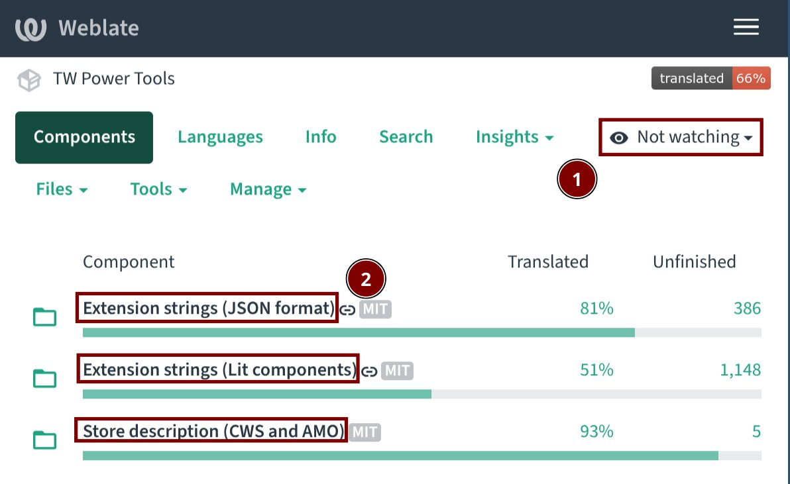
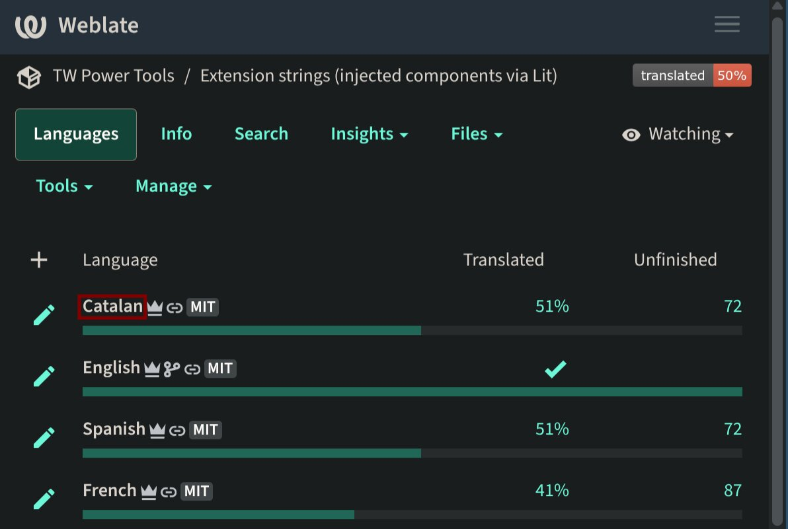

# Translator guide

*** promo
**1-minute start/TL;DR:** Just sign up at
https://i18n.avm99963.com/engage/tw-power-tools/ and start contributing.
[Request to be a Translator](#requesting-a-role) to contribute translations
that don't need to be approved instead of suggestions.
***

[TOC]

## How to contribute translations

To manage translations, we use Weblate: a web tool that lets you contribute
translations easily.

You can get started with the "TL;DR" instructions above and explore Weblate as
you wish. But since the UI is somewhat complex, here are some instructions on
how to get started translating.

*** aside
**Note:** There are multiple ways of doing the same thing so, again, don't be
afraid to explore Weblate by yourself!
***

1. Go to https://i18n.avm99963.com/engage/tw-power-tools/ and sign up with your
   Google or GitHub account.
1. After signing up, it is recommended to go to
   https://i18n.avm99963.com/accounts/profile/ and:
    - In the **"Languages"** tab, select the languages you want to translate.
    - In the **"Account"** tab, select the email you want to associate your
      contributions to in **"Commit e-mail"**.

    *** note
    **Important**: Your commit e-mail will be public, so select the
    autogenerated `@users.noreply.i18n.avm99963.com` email if you want your
    real email address to stay private.

    After you submit translations, the selected email will be permanently
    associated to your contributions. Since commits (changes) are immutable,
    there is no way to delete it after the translations are committed.
    ***

1. Now go to https://i18n.avm99963.com/projects/tw-power-tools/. This is the
   project homepage for the TW Power Tools project in Weblate.
    - If you want to get notified of new strings to translate, click the **"Not
      watching"** dropdown, and then select **"Watch project TW Power Tools"**.
1. You'll see that the TW Power Tools project is separated into different
[components](#translation-components). Select one of them to start translating
it.

   

1. Select the language you want to translate the component into.

   

1. Now you'll see a summary of the translation status. You can click
   **"Unfinished strings without suggestions"** and start translating!

### Suggestions vs. translations

To prevent abuse, when you're a new user in Weblate, you will not be able to
submit "translations". Instead, you can only submit "suggestions" that need to
be approved by contributors with the Translator role to turn them into actual
translations. Please read more about this in the [roles](#roles) section.

That's why it is recommended that you [request the Translator
role](#requesting-a-role) as soon as possible! After you get the role, you can
approve your own suggestions if they haven't been already approved by others.

## Translation components

The extension has multiple strings (technical term for "text") that can be
translated. These are split into multiple components:

- **Extension strings:** text shown in the extension's user interface, such as
  components injected to the forums platform (e.g., the bulk move dialog), the
  options page, the workflows manager, etc.

  They are separated into 2 components, since we use 2 different technologies
  to build UI, and each manages translations differently:
    - **Extension strings (JSON format):** strings saved in the regular format
      used by web extensions. This format is now rarely used for new text.
    - **Extension strings (Lit components):** strings used in the advanced UI
      components created with Lit. You will be able to recognize Lit components
      because most of them use [Material Design components][mwc].
- **Store description (CWS and AMO):** this component holds the translations
  for the description of the extension shown in the [Chrome Web Store][cws] and
  in the [AMO (Firefox Add-ons Store)][amo] listings.

## Translations life cycle

Here is the life cycle of a translation, from the moment it is contributed in
Weblate until it reaches all users:

1. **Translations are contributed in Weblate** as explained
   [above](#how-to-contribute-translations).
1. **Weblate sends updated translations to Gerrit.** Weblate is just a tool to
   manage translations, but ultimately the translations have to be incorporated
   into the extension's source code. Weblate thus periodically submits updated
   strings to Gerrit, our code review system.
1. **Translations are reviewed and merged in Gerrit.** In Gerrit, these changes
   are reviewed and then merged by [committers][committers] into the source
   code. To approve a change:
    - A human must give a `Code-Review+2` vote after reviewing it.
    - Additionally, our CI system (Zuul) must give a `Verified+1` vote, which
      means that the changed code passes all tests and can be released.
1. **Canary release.** Every night, a [Canary release][canary] is automatically
built and released with the latest merged changes. This is a good opportunity
to see the updated strings in the extension and check they look fine.
1. **Beta and stable releases.** Every once in a while, a manual release is cut
with the current state of the source code (including all the merged
translations until the moment of cutting the release).

   This release is first uploaded as a beta version to the Chrome Web Store,
   and after some days it is released in the CWS as a stable version. Due to
   the low amount of Firefox users, and to reduce complexity, the release is
   immediately uploaded to AMO (the Firefox Add-ons Store).

   [This doc](../developers/release_cycle.md) includes more information on how
   developers create releases.

## Roles

To manage translations, we have different roles:

- **New translators:** by default, new translators can only suggest
  translations in Weblate.
- **Translators:** contributors with this role can directly submit
  translations, which will be automatically sent to Gerrit for a final review.
   - Anyone can ask to be a translator. This role will be given immediately.
- **Committers:** contributors with this role can review changes to
  translations in Gerrit and merge them to the source code (or "submit them"
  using Gerrit's terminology).
   - Feel free to propose yourself for this role! Committers are expected to be
     trusted members of the community, ideally with experience with software
     development and particularly doing code review.
   - [List of committers][committers]

The processes to apply to roles may change when/if we establish a governing
model for the project.

### Requesting a role

To propose yourself for a role, please join the [twpowertools-translators
group][translators-group] and create a post, or send an email to `[group name]
[at] avm99963 [dot] com`, which will create a post there as well.

## Adding a new language

If you'd like to translate the extension to a language that is not available in
Weblate, please ask in the twpowertools-translators group, and we will make the
language available in Weblate.

Developers can learn how to add a language in the document
[add\_a\_new\_language.md][add-new-language].

## Resources available

- [**twpowertools-translators** Google Group][translators-group]: a mailing
  list with discussions or announcements related to translating the extension.
- [**twpt-i18n-reviews** Google Group][i18n-reviews-group]: a read-only mailing
  list that receives automatic notifications about translation changes in
  Gerrit. Committers can subscribe to be notified of new changes that require
  review.
- [**twpowertools-discuss** Google Group][discuss-group]: a mailing list with
  general discussions related to the extension.

[translators-group]: https://groups.google.com/a/avm99963.com/g/twpowertools-translators
[cws]: https://chromewebstore.google.com/detail/tw-power-tools/hpgakoecmgibigdbnljgecablpipbajb
[amo]: https://addons.mozilla.org/firefox/addon/tw-power-tools/
[mwc]: https://material-web.dev/about/intro/
[json-owners]: https://gerrit.avm99963.com/plugins/gitiles/infinitegforums/+/HEAD/src/static/_locales/OWNERS
[lit-owners]: https://gerrit.avm99963.com/plugins/gitiles/infinitegforums/+/HEAD/src/lit-locales/source/OWNERS
[committers]: https://gerrit.avm99963.com/admin/groups/b1abbd3038e80a7471b89117367df6de2033c72a,members
[canary]: ../contributing.md#canary-channel
[i18n-reviews-group]: https://groups.google.com/a/avm99963.com/g/twpt-i18n-reviews
[discuss-group]: https://groups.google.com/g/twpowertools-discuss
[add-new-language]: ./add_a_new_language.md
